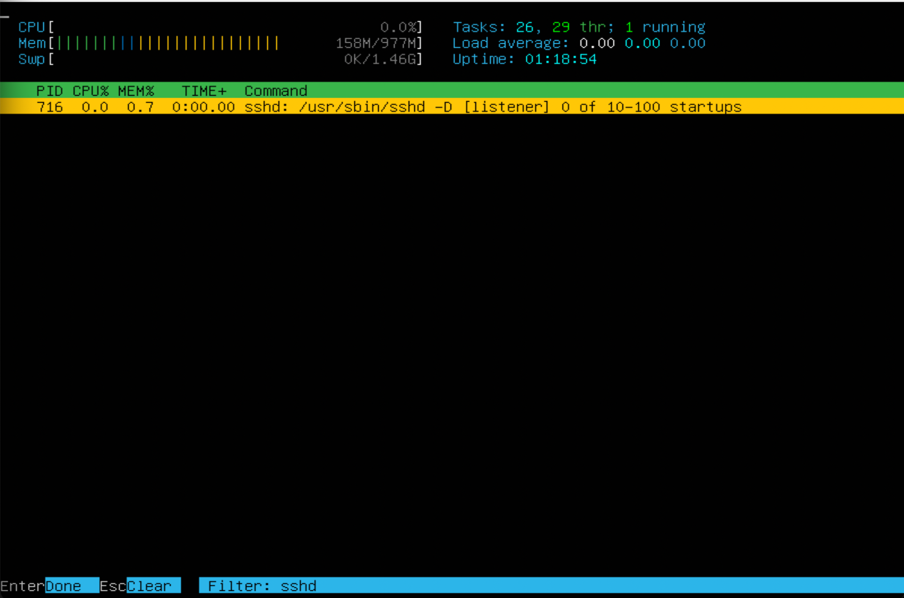

## Part 1. Установка ОС

Выполнив команду "cat /etc/issue" можем узнать версию  Ubuntu.

## Part 2. Создание пользователя

Создаем нового пользователь "test1" с помощью команды "sudo adduser test1", задаем пароль и вводим при необходимости другие данные. Для добавление пользователя в группу "adm" воспользуемся командой "usermod -a -G adm test1", где:
- флаг "-a" - Добавить пользователя в дополнительную группу(ы). Использовать только вместе с параметром -G.
- флаг "-G" - Дополнительные группы.
- "adm" - наименование группы.
- "test1" - наименование пользователя.

Выведем нового пользователя с помощью команды "cat /etc/passwd".

## Part 3. Настройка сети ОС

Зададим название виртуальной машины "user-1" командой "sudo hostnamectl set-hostname user-1". Для проверки смены имены введем команду "hostnamectl status".

С помощью команды "sudo timedatectl set-timezone Europe/Moscow" меняем временную зону. Для проверки введем "timedatectl"

Для вывода сетевых интерфейсов воспользуемся командой "ifconfig", предварительно установив его.

Пропингуем удаленные хосты "1.1.1.1" и "ya.ru" с помощью команды "ping"

## Part 4. Обновление ОС

Сделаем обновление системных пакетов в помощью программы "sudo apt-get upgrade". При повторном использовании в терминале появляется информация, что обновлений на данный момент нет.

## Part 5. Использование команды sudo

Добавим пользователя, созданного в "Part 2" в группу "sudo" для использования одноименной программы. Переключившись на пользователя "test1" изменим "hostname ОС" с помощью редактора "vim".

## Part 6. Установка и настройка службы времени

Выведем в консоль информацию о времени и дате с помощью команды "timedatectl". В ней будет подродная информация о времени, часовом поясе, в котором вы сейчас находитесь. При использовании команды "timedatectl show" опция "TPSynchronized=yes" включена.

## Part 7. Установка и использование текстовых редакторов

Взял для работы три редактора: "VIM", "NANO", "MCEDIT". Создал 3 файла согласно инструкции для редактирования.

Для сохраниения измений в редакторе "VIM" используется команда: нажимаем "ESC" для выхода в "командный режим", вводим ":" (двоеточие), вводим "wq".

Для сохраниения измений в редакторе "NANO" используется команда: нажимаем "CTRL + X" -  выход из Nano, в диалоговом окне выбираем сохранение клавишей "Y".

Для сохраниения измений в редакторе "MCEDIT" используется команда: нажимаем "fn + F2" -  сохранение, "fn + F10" выход.

Для выхода без измений в редакторе "VIM" используется команда: нажимаем "ESC" для выхода в "командный режим", вводим ":" (двоеточие), вводим "q!".

Для выхода без измений в редакторе "NANO" используется команда: нажимаем "CTRL + X" -  выход из Nano, в диалоговом окне выбираем без сохранения клавишей "N".

Для выхода без измений в редакторе "MCEDIT" используется команда: нажимаем "fn + F10" выход, в диалоговом окне выбираем без сохранения.

Чтобы найти и земенить в редакторе "VIM", необходимо воспользоваться командой: нажимаем "ESC" для выхода в "командный режим", вводим ":s/welkerra/21 School 21".

Чтобы найти и земенить в редакторе "NANO", необходимо воспользоваться командами: Нажмите "Ctrl+\", введите строку, которую необходимо искать и нажмите клавишу "Enter". Затем введите строку, на которую произвести замену и нажмите "Enter", для подтверждения операции нажать "Y". 

Чтобы найти и земенить в редакторе "MCEDIT", необходимо воспользоваться командой: нажимаем "fn + F4", вводим строку которые необходимо найти и на которую заменить и нажимаем "Enter".

## Part 8. Установка и базовая настройка сервиса SSHD

Команда ps выводит список текущих процессов на вашем сервере в виде таблицы, с которой можно удобно работать: сортировать, изменять количество колонок и прочие. У утилиты ps множество настроек, с помощью которых можно тонко настраивать вывод команды, также никто не запрещает вам делать конвейеры, чтобы отсечь всё лишнее.

Опции, отбирающие процессы для отчёта:
- -A : все процессы;
- -a : связанные с конкретным терминалом, кроме главных системных процессов сеанса, часто используемая опция;
- -N : отрицание выбора;
- -d : все процессы, кроме главных системных процессов сеанса;
- -e : все процессы;
- -p: только перечисленные процессы (следом указывается один или несколько PID);
- -f : расширение информации;
- -T : все процессы на конкретном терминале;
- -a : процессы, связанные с текущим терминалом, а также процессы других пользователей;
- -r : информация только о работающих процессах;
- -x : процессы, отсоединённые от терминала;
- -u : выбор идентификатора(ов) эффективного пользователя;
- -U : выбор идентификатора(ов) реального пользователя.
- -o : позволяет определить свой формат вывода (после -o добавляем pid,comm,tty)

Команда Netstat выводит статистику для следующих объектов.
- Протокол
- Имя протокола (TCP или UDP).
- Локальные адреса:
IP-адрес локального компьютера и номер используемого порта. Имя локального компьютера, соответствующее IP-адресу и имени порта, выводится только в том случае, если не указан параметр -n. Если порт не назначен, вместо номера порта будет выведена звездочка (*).

- Внешние адреса: 
IP-адрес и номер порта удаленного компьютера, подключенного к данному сокету. Имена, соответствующие IP-адресу и порту, выводятся только в том случае, если не указан параметр -n. Если порт не назначен, вместо номера порта будет выведена звездочка (*).

- (Состояние)
Указание состояния подключения TCP. Возможные значения:

    -  CLOSE_WAIT

    - CLOSED

    - ESTABLISHED

    - FIN_WAIT_1

    - FIN_WAIT_2

    - LAST_ACK

    - LISTEN

    - SYN_RECEIVED

    - SYN_SEND

    - TIMED_WAIT

## Part 9. Установка и использование утилит top, htop

Команда top показывает запущенные в Linux процессы программ и служб, данные о потреблении системных ресурсов и позволяет искать, останавливать и управлять процессами.
- В самой верхней строке показано: текущее время в системе, аптайм (время работы после загрузки), общее количество пользователей и средняя нагрузка за последние 1, 5 и 15 минут.
- 2-ая строка показывает информацио о процессах
- 3-ая строка загрузка cpu
- 4-ая строка загрузка памяти(MiB Mem)
- Первый столбец в таблице: pid процесса занимающего больше всего памяти
- Столбец "TIME+" - указывает занимаемое процессорное время

Скрины с выводом команды "htop"

Отсортированному по PID, PERCENT_CPU, PERCENT_MEM, TIME

Отфильтрованному для процесса sshd

C процессом syslog, найденным, используя поиск

C добавленным выводом hostname, clock и uptime

## Part 10. Использование утилиты fdisk

С помощью команды "fdisk" узнаем следующее:

- Название диска - VBOX MODEL
- Размер диска - 10 GiB
- Количество секторов - 20971520 
- Размер swap - 1534972

## Part 11. Использование утилиты df

Введем команду "df". "-h" - выводит данные в более читаемом формате(Еденица измерения G). По умолчанию, количество места на дисках выводится в килобайтах.

Для корневого раздела:
- Размер раздела: 8408452
- размер занятого пространства: 4364360
- размер свободного пространства: 3595376
- процент использования: 55%

Введем команду "df" с опцией "-Th".

Для корневого раздела:
- Размер раздела: 8.1G
- Размер занятого пространства: 4.2G
- Размер свободного пространства: 3.5G
- Процент использования: 55%
- Тип файловой системы для раздела: ubuntu--vg-ubuntu--lv

## Part 12. Использование утилиты du

Выведем на экран размер папок /home, /var, /var/log. С помощью ключа "-h" приводим в читаемый вид.

Выведем размер всего содержимого в /var/log

## Part 13. Установка и использование утилиты ncdu

В данном задании выводим размер папок с помощью утилиты ncdu.

## Part 14. Работа с системными журналами

С помощью команды last выведем истории входа в систему.

- Время последней успешной авторизации: Tue Mar 14 18:56
- Имя пользователя: welkerra
- Метод входа в систему: tty1(локальный вход)

Скрин с сообщением о рестарте службы SSHd.

## Part 15. Использование планировщика заданий CRON

Для создание задачи в планировщике воспользуемся командой "sudo crontab -e" и добавим строку для выполнения "*/2 * * * * uptime". В сисетмных логах проверяем наличие задачи uptime

Удаляем список заданий с помощью "sudo crontab -r" и проверим.

